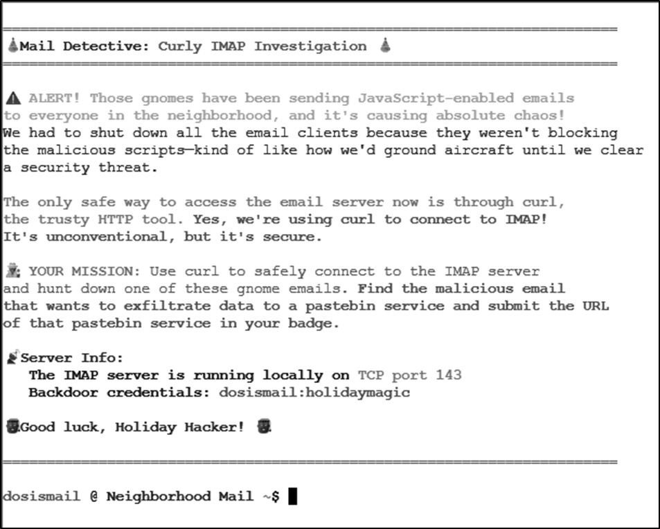
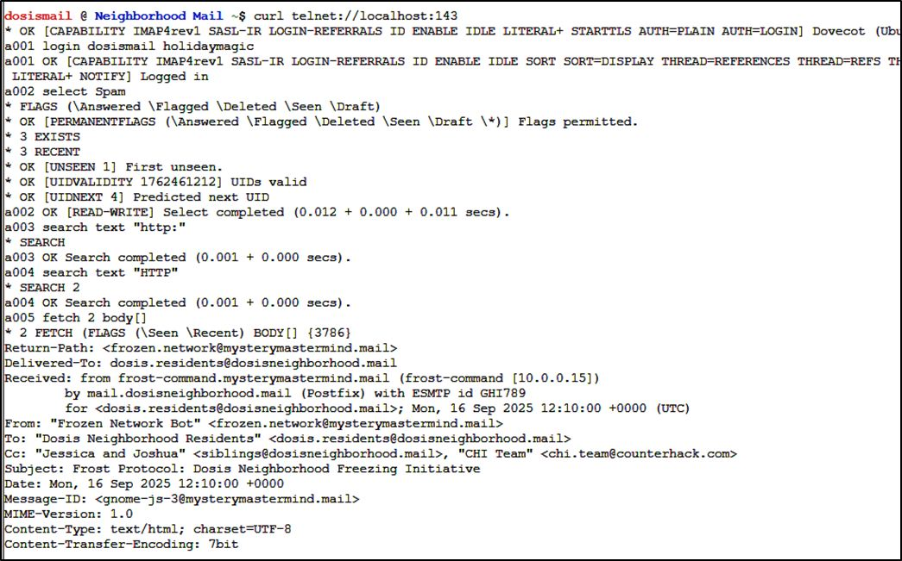

|[Previous Objective: Act2 Name](/act3_hackagnome_mjd.md)  |   [Home Page](/index.md) | [Next Objective: Act 2 IDORable Bistro](/act2_idorable_bistro_mjd.md)
| :----------------------- | :--------------------------------: | --------------------------------: |

| Objective: Mail Detective    | Difficulty Level: 2 |
| :-----------------------: | :--------------------------: |
| Help Mo in City Hall solve a curly email caper and crack the IMAP case. What is the URL of the pastebin service the gnomes are using? | Location: City Hall |

## Solution Overview

This objective investigates suspicious emails using IMAP (Internet Message Access Protocol) commands via curl. The investigator connected to an IMAP server running on localhost port 143 using telnet protocol. Authentication was performed using the credentials "dosismail" with password "holidaymagic". After successful login, the investigator selected the "Spam" mailbox to examine suspicious messages. Multiple search commands were executed to find emails containing HTTP URLs, with the search for "HTTP" (uppercase) returning positive results. The investigator used the IMAP FETCH command to retrieve the full body of message ID 2. Examination of the email body revealed embedded JavaScript code containing a suspicious variable assignment. The JavaScript code contained a URL pointing to "https://frostbin.atnas.mail/api/paste", which appears to be a pastebin-style service potentially used for command and control or data exfiltration. This investigation demonstrates how IMAP protocol commands can be used for email forensics and threat hunting.


| Activity | Primary Tactic | MITRE ATT&CK Technique ID | MITRE ATT&CK Technique Name |
|----------|----------------|---------------------------|----------------------------|
| Connect to IMAP server on localhost port 143 using telnet | Discovery | T1046 | Network Service Discovery |
| Authenticate to email server using credentials (dosismail/holidaymagic) | Initial Access | T1078.003 | Valid Accounts: Local Accounts |
| Search for emails containing "http:" and "HTTP" text strings | Discovery | T1083 | File and Directory Discovery |
| Examine email content for suspicious URLs and scripts | Discovery | T1213.002 | Data from Information Repositories: Sharepoint |
| Extract malicious URL "https://frostbin.atnas.mail/api/paste" | Collection | T1005 | Data from Local System |


## Detailed Solution
<details>
<summary>Click to expand</summary>

This is a helpful resource for reading messages using curl: https://everything.curl.dev/usingcurl/reademail.html



Connect to the server using curl:

```bash
telnet://localhost:143
```
The following commands were used:

```
a001 login dosismail holidaymagic
a002 select Spam
a003 search text "http:"
a004 search text "HTTP"
a005 fetch 2 body[]
```

This search returns a match.



Scrolling down the body is:


```javascript
var pastebinUrl = "https://frostbin.atnas.mail/api/paste";
```

**Answer: https://frostbin.atnas.mail/api/paste**

</details>

## Tools Reference

| Tools Used           | Tool Version |
| :-----------------------: | :--------------------------------: |
| curl | 8.11.0 | 

## Hints Reference
| Provided By         | Hint |
| :-----------------------: | :--------------------------------: |
| Santa | If I heard this correctly...our sneaky security gurus found a way to interact with the IMAP server using Curl! Yes...the CLI HTTP tool! Here are some helpful docs I found https://everything.curl.dev/usingcurl/reademail.html |
| Mo | So here's our situation: those gnomes have been sending JavaScript-enabled emails to everyone in the neighborhood, and it's causing chaos. We had to shut down all the email clients because they weren't blocking the malicious scripts - kind of like how we'd ground aircraft until we clear a security threat. The only safe way to access the email server now is through curl - yes, the HTTP tool! Think you can help me use curl to connect to the IMAP server and hunt down one of these gnome emails? |


## Acknowledgements
| Provided By         | Notes |
| :-----------------------: | :--------------------------------: |
| none | none |


|[Previous Objective: Act2 Name](/act3_hackagnome_mjd.md)  |   [Home Page](/index.md) | [Next Objective: Act 2 IDORable Bistro](/act2_idorable_bistro_mjd.md)
| :----------------------- | :--------------------------------: | --------------------------------: |
